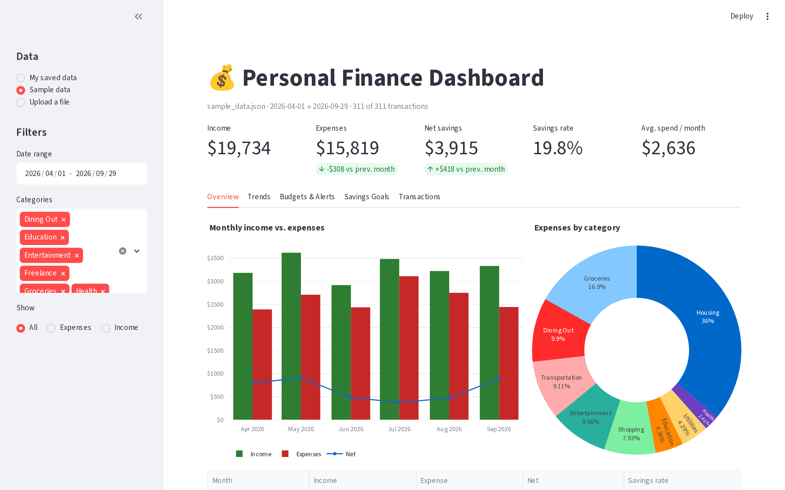
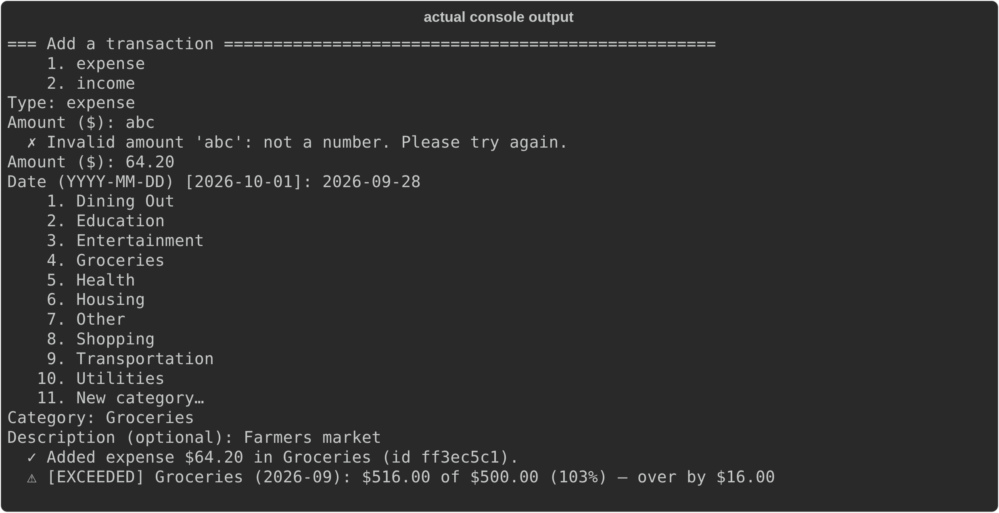
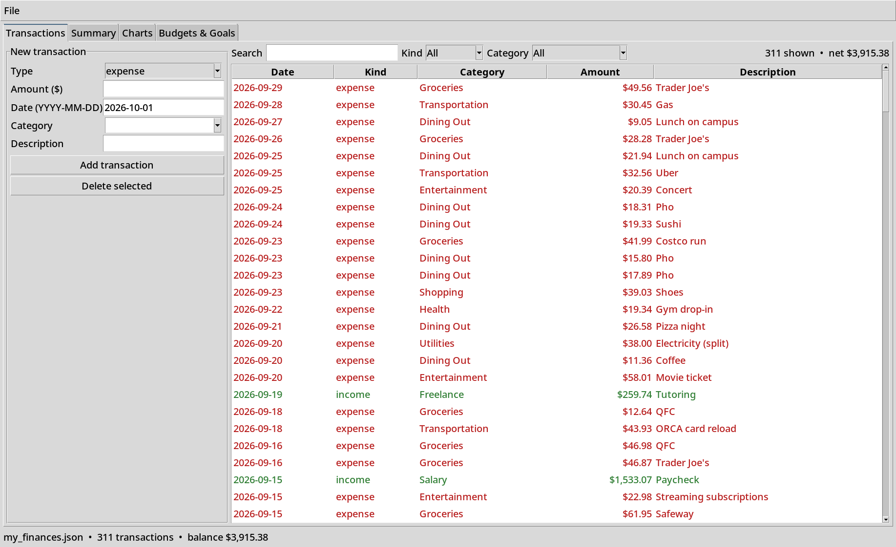
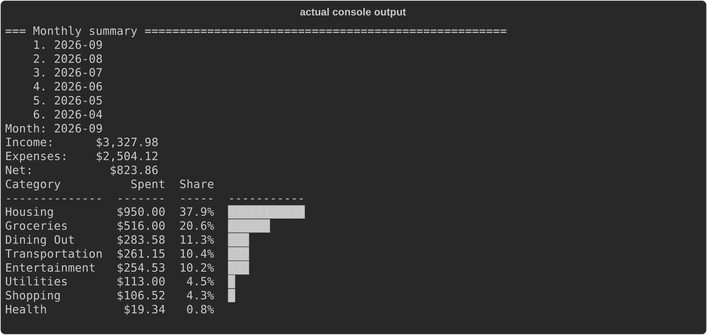
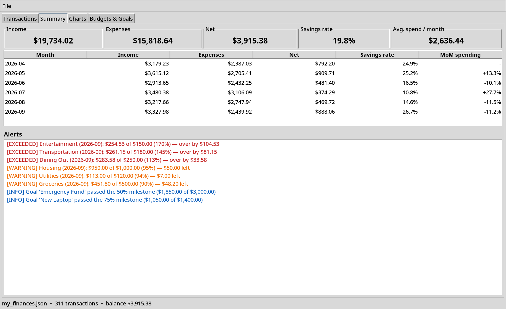
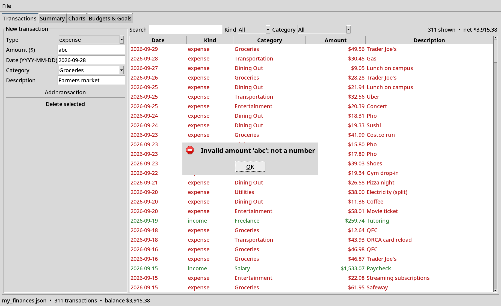
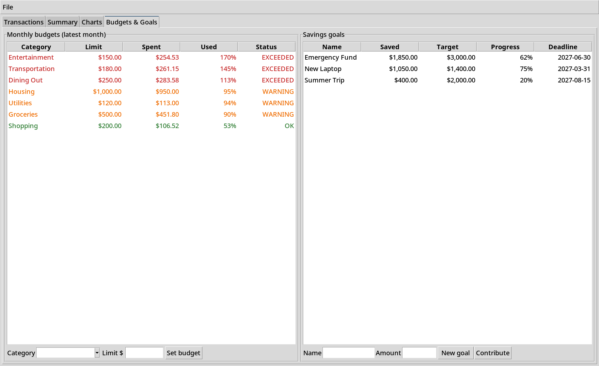
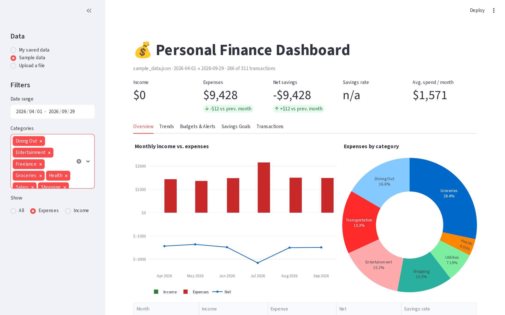
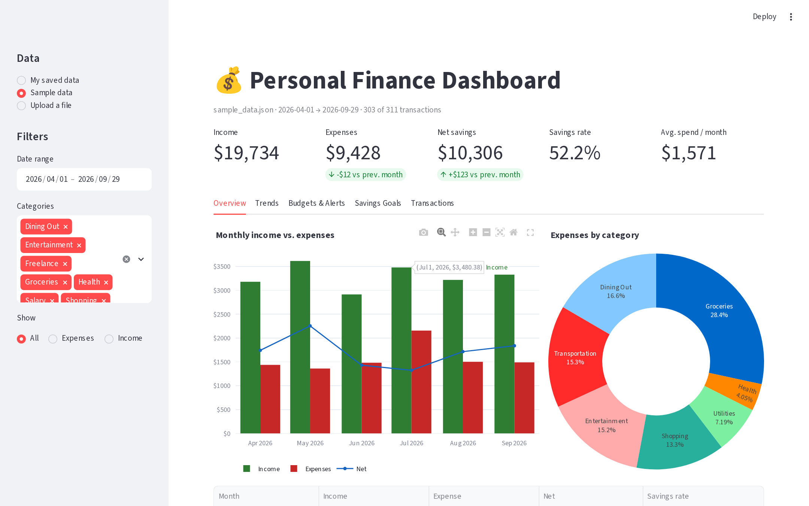
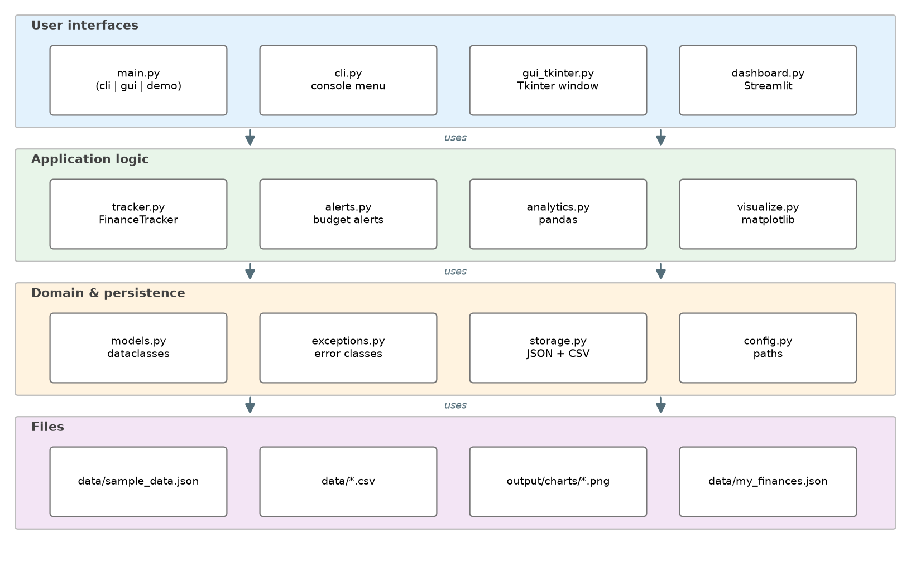

# 💰 Personal Finance Tracker


A Python application that tracks income and expenses, categorises transactions, follows
budgets and savings goals, and turns everything into summaries, trends and charts. The same
tested core powers **a console menu, a Tkinter desktop app and a Streamlit web dashboard**.

> Developed for **DATA 333 – Data Management & Analysis – Bellevue College**
> (Prior Learning Assessment).



---

## ✨ Features

| | Feature | Details |
|---|---|---|
| ➕ | **Transactions** | Add, edit, delete, text search, filters (kind, category, dates, amount). Every value is validated. |
| 🗂️ | **Categories** | Built-in expense and income categories; new names are normalised (`food` → `Food`) and stored in a set. |
| 📊 | **Summaries & trends** | Monthly income, expenses, net and savings rate; category shares; 3-month rolling average; month-over-month change; top expenses (pandas). |
| 🚦 | **Budget alerts** | Monthly limit per category: **WARNING** at 80 %, **EXCEEDED** at 100 %, raised immediately after a new expense. |
| 🎯 | **Savings goals** | Target, deadline, contributions and milestones at 25 / 50 / 75 / 100 %. |
| 💾 | **JSON + CSV storage** | Full state in JSON, transactions in CSV (import/export). Atomic writes; a corrupted file is backed up and the app still starts. |
| 📈 | **Visualisation** | matplotlib charts saved as PNG and embedded in the GUI; interactive Plotly charts in the dashboard. |

## 📸 Screenshots

| Console (CLI) — actual console output | Tkinter GUI |
|---|---|
|  |  |
|  |  |

| Tkinter — validation error | Tkinter — budgets & alerts |
|---|---|
|  |  |

| Dashboard — filters applied | Dashboard — interactive chart |
|---|---|
|  |  |

All images are produced by `python tools/capture_screenshots.py` from the running
application, on the sample data. The GUI runs on a private Xvfb display and is grabbed
with ImageMagick. The dashboard is a real Streamlit server driven by headless Chromium.
The console images are the real output of `python main.py demo` and of a scripted
`python main.py cli` session, recorded with `rich`. The tool needs Xvfb (Linux),
ImageMagick and `python -m playwright install chromium`.

## 🚀 Installation

**Requires Python 3.11+** (pandas 3 needs it) (Tkinter is included with python.org installers; on Debian/Ubuntu
run `sudo apt install python3-tk`).

```bash
git clone https://github.com/14juanito/Personal-finance-tracker.git
cd Personal-finance-tracker
python3 -m venv .venv
source .venv/bin/activate          # Windows: .venv\Scripts\activate
pip install -r requirements.txt
```

## ▶️ Usage

### 1. Demo mode: non-interactive, runs everything

```bash
python main.py demo
```

This loads `data/sample_data.json` (311 fictional transactions, April to September 2026) and
prints the overall summary, a monthly pivot table, the category breakdown, the spending trend,
the top expenses, budget alerts and goal progress. It writes the charts to `output/charts/*.png`
and the exports to `output/demo_data.json` and `output/demo_transactions.csv`.

### 2. Console mode

```bash
python main.py cli
```

A numbered menu to add, list, search, edit and delete transactions, view monthly summaries and
pandas trends, manage budgets and goals, generate charts, and import or export files. Invalid
input is explained and asked again. On first launch the sample data is loaded; your own data is
saved to `data/my_finances.json`, which is git-ignored.

### 3. Desktop GUI (Tkinter)

```bash
python main.py gui
```

Four tabs: **Transactions** (entry form, live search, sortable table), **Summary** (KPIs,
monthly table, colour-coded alerts), **Charts** (embedded matplotlib) and **Budgets & Goals**.
The File menu handles saving and CSV import and export.

### 4. Interactive dashboard (Streamlit)

```bash
streamlit run finance_tracker/dashboard.py
```

The sidebar lets you choose the data source (sample data, your saved data, or an uploaded CSV
or JSON file) and filter by date range, category and kind. The page shows KPIs with
month-over-month deltas, Plotly charts, a category × month heatmap, budget and goal progress,
and a CSV download of the filtered rows.

Options: `--data PATH` selects the JSON file for any mode, and `--output DIR` sets the demo
output folder.

## 🗂️ Project structure

```
Personal-finance-tracker/
├── main.py                     # entry point: cli | gui | demo
├── finance_tracker/
│   ├── models.py               # Transaction, SavingsGoal, Budget (validated dataclasses)
│   ├── exceptions.py           # custom exception hierarchy
│   ├── storage.py              # JSON + CSV, atomic writes, corrupted-file recovery
│   ├── tracker.py              # FinanceTracker: list / dict / set, CRUD, search, filter
│   ├── analytics.py            # pandas: monthly summary, categories, trends, KPIs
│   ├── alerts.py               # budget thresholds, goal milestones
│   ├── visualize.py            # matplotlib charts → output/charts/*.png
│   ├── config.py               # pathlib-based project paths
│   ├── cli.py                  # console menu
│   ├── gui_tkinter.py          # Tkinter desktop app
│   └── dashboard.py            # Streamlit dashboard
├── data/                       # sample_data.json, sample_transactions.csv
├── tests/                      # pytest suite
├── tools/                      # sample data, screenshots, report/slides builders
├── docs/                       # figures/ (real captures), report/ + memo/ (LaTeX), shared/
├── deliverables/               # report, slides, video script, defence guide, source zip
└── PLAN.md · DECISIONS.md · DEV_LOG.md
```



## 🧪 Tests

```bash
pytest -q                 # run the test suite
pytest --cov              # with coverage of the finance_tracker package
ruff check . && ruff format --check .
```

The suite has more than 150 tests. Coverage is about 98 % of the lines in the `finance_tracker`
package, **excluding** `gui_tkinter.py` (Tkinter) and `dashboard.py` (Streamlit): their event
code is exercised by smoke tests instead (see `[tool.coverage.run]` in `pyproject.toml`). The tests cover:
- nominal use;
- invalid input (amounts, dates, kinds, empty names);
- missing and corrupted files, and CSV files with missing columns or bad rows;
- every pandas calculation, checked against a hand-computed dataset;
- full scripted CLI sessions;
- a Tkinter smoke test on a real display, skipped automatically when there is none;
- a headless Streamlit `AppTest`;
- a code-standards test that enforces module headers, Google-style docstrings, type hints and `# Concept:` tags.

## 📚 Course concepts

Every concept from the brief is labelled in the code with a `# Concept:` comment:

```bash
grep -rn "# Concept:" finance_tracker main.py
```

The concepts covered are user input and output, decision structures, loops, functions, file
handling, exceptions, lists, dictionaries, sets, OOP and pandas. The mapping table is in the
[project report](deliverables/Project_Report.pdf).

## 📄 Report & documentation

| Document | Source | PDF | Content |
|---|---|---|---|
| Project report (English) | `docs/report/Project_Report.tex` | `deliverables/Project_Report.pdf` (7 pages) | Overview and objectives, key features with real captures, concepts table with code excerpts, TikZ architecture diagram, libraries and versions, challenges (from `DEV_LOG.md`), enhancements, testing, lessons |
| Technical memo (French) | `docs/memo/Memo_Technique.tex` | `deliverables/Memo_Technique.pdf` (27 pages) | Oral-defence preparation, from simple to advanced: concepts with definitions and analogies, every library, module-by-module walkthrough, data formats, tests, commands, 15 evaluator questions, glossary |

Both documents are built by one command:

```bash
python tools/build_latex.py      # captures → generated excerpts/figures → latexmk → deliverables/*.pdf
python tools/build_latex.py --skip-capture   # reuse docs/figures/
```

The build is reproducible and checks itself:
- `tools/capture_screenshots.py` takes real screenshots into `docs/figures/` (Tkinter on Xvfb,
  Streamlit through headless Chromium, console output recorded with `rich`);
- code excerpts are extracted from the source with `ast`, never copied by hand
  (`docs/shared/generated/`);
- `meta.tex` holds the real test count, coverage, library versions, date and the name field;
- the build fails on LaTeX errors, undefined references, overfull boxes above 10 pt, or a
  report outside 5–8 pages.

It needs a TeX Live distribution with `latexmk`, `babel-french`, TikZ, `listings` and
`tcolorbox` (Debian/Ubuntu: `texlive-latex-extra texlive-lang-french texlive-pictures latexmk`),
plus Xvfb and ImageMagick for the GUI captures.

## 📦 Deliverables

| File | Description |
|---|---|
| `deliverables/Project_Report.pdf` | Project report (LaTeX, English), see *Report & documentation* above |
| `deliverables/Memo_Technique.pdf` | Technical memo for the oral defence (LaTeX, French) |
| `deliverables/Demo_Slides.pptx` | 8-slide presentation |
| `deliverables/Demo_Video_Script.md` | 4-minute narration with timestamps and an OBS checklist |
| `deliverables/Code_Defense_Guide.md` | Oral defence preparation guide (in French) |
| `deliverables/CodeStepByStep_Screenshots.docx` | CodeStepByStep exercise screenshots (from `codestepbystep_screenshots/`) |
| `deliverables/finance_tracker_source.zip` | Source code and data |

Rebuild them with `python tools/build_latex.py`, `python tools/build_slides.py`,
`python tools/build_screenshot_doc.py` and `python tools/build_source_zip.py`.

---

Developed for **DATA 333 – Bellevue College**. All sample data is fictional.
